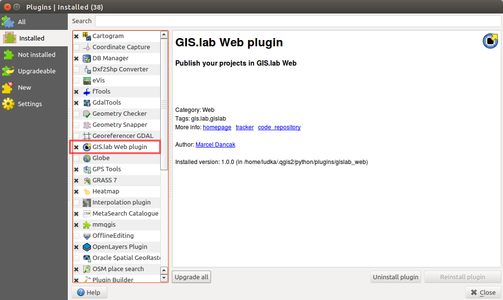
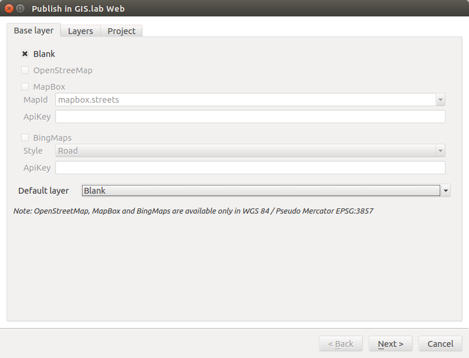
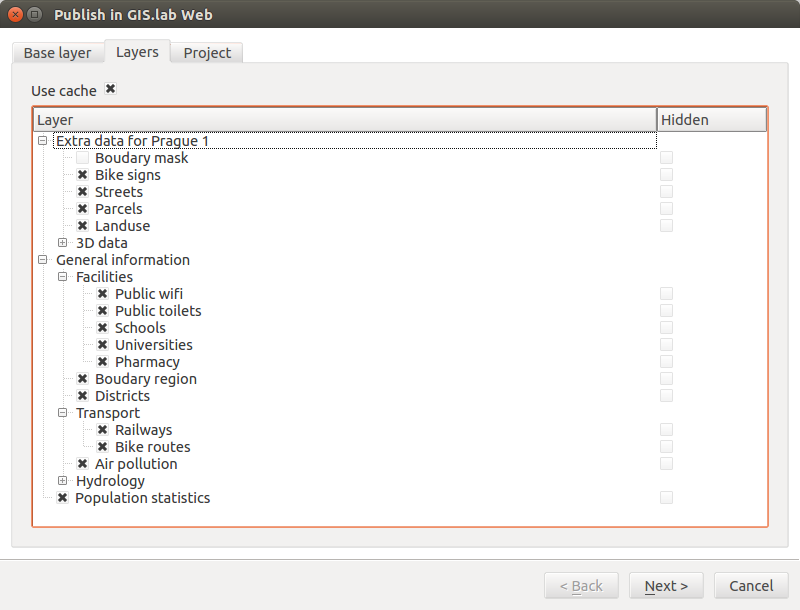
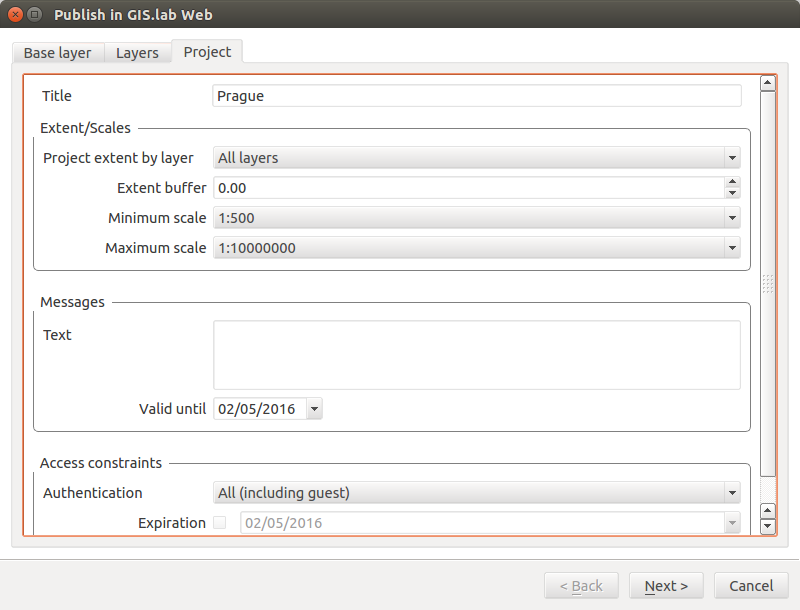
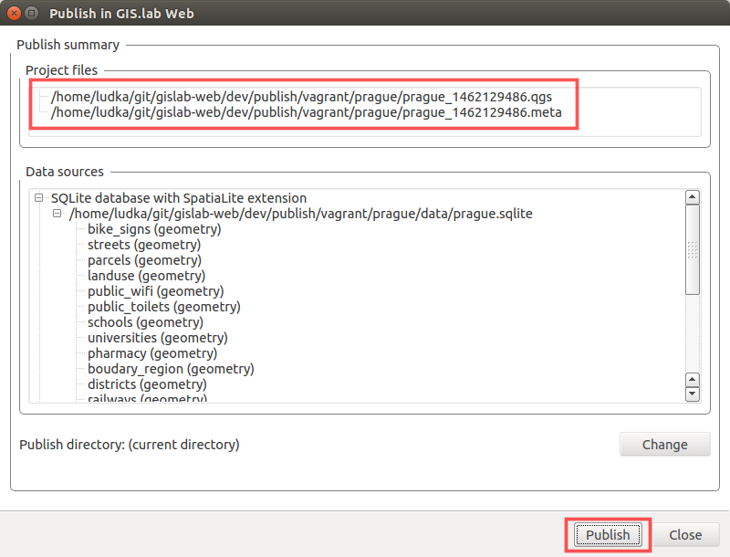

.. _installation-web:
 
============
Installation
============  

As it was noticed in previous subsection, very important part is represented
by :ref:`Gisquick QGIS plugin <gisquick-qgis-plugin>`.

This plugin is part of ``gisquick`` source code, so all necessary files
are downloaded with cloning process. But let us stick to this order of 
things. See instructions below.

--------------------------------
Creating development environment
--------------------------------

At first, it is necessary to clone source code with Git.

.. code:: sh

   git clone https://github.com/gislab-npo/gisquick.git

Then optionaly GIS.lab Mobile can be enabled by adding configuration variable 
to ``provision/host_vars/gisquick`` file as ``GISLAB_CLIENT_MOBILE: yes``.

Development environment is started after running following, well known 
command from source code root directory.

.. code-block:: sh
   :emphasize-lines: 1

   $ vagrant up

   Bringing machine 'gisquick' up with 'virtualbox' provider...
   ==> gisquick: Clearing any previously set forwarded ports...
   ==> gisquick: Clearing any previously set network interfaces...
   ==> gisquick: Preparing network interfaces based on configuration...
       gisquick: Adapter 1: nat
   ==> gisquick: Forwarding ports...
       gisquick: 90 => 8090 (adapter 1)
       gisquick: 8000 => 8000 (adapter 1)
       gisquick: 8100 => 8100 (adapter 1)
       gisquick: 8200 => 8200 (adapter 1)
       gisquick: 35729 => 35729 (adapter 1)
       gisquick: 22 => 2222 (adapter 1)
   ==> gisquick: Running 'pre-boot' VM customizations...
   ==> gisquick: Booting VM...
   ==> gisquick: Waiting for machine to boot. This may take a few minutes...
       gisquick: SSH address: 127.0.0.1:2222
       gisquick: SSH username: vagrant
       gisquick: SSH auth method: private key
       gisquick: Warning: Connection timeout. Retrying...
       gisquick: Warning: Remote connection disconnect. Retrying...
   ==> gisquick: Machine booted and ready!
   ==> gisquick: Checking for guest additions in VM...
   ==> gisquick: Setting hostname...
   ==> gisquick: Mounting shared folders...
       gisquick: /vagrant => /home/ludka/git/gisquick
   ==> gisquick: Machine already provisioned. Run `vagrant provision` or use the `--provision`
   ==> gisquick: flag to force provisioning. Provisioners marked to run always will still run.

.. note:: |note| Minimum version of Ansible is ``2+``, see :ref:`Ansible installation <ansible-installation>`. 

.. note:: |note| To speed up provisioning using **Apt proxy server**, set 
   ``APT_PROXY`` variable before running above command like 
   ``$ export APT_PROXY=http://192.168.99.118:3142``. 

See :ref:`Apt Cacher server <apt-cacher-service>` instructions for more details
in this matter. Thanks to that, with next installation of server it can be faster 
because software packages will have not to be downloaded again.

After, one can log in to virtual machine - still from source code root directory.

.. code-block:: sh
   :emphasize-lines: 1
   
   $ vagrant ssh

   Welcome to Ubuntu 14.04.4 LTS (GNU/Linux 3.13.0-83-generic i686)
   
    * Documentation:  https://help.ubuntu.com/
   
    System information disabled due to load higher than 1.0
   
     Get cloud support with Ubuntu Advantage Cloud Guest:
       http://www.ubuntu.com/business/services/cloud
   
   
   Last login: Wed Apr 13 08:49:28 2016 from 10.0.2.2

At this moment virtual machine is launched. Development services are started
after command below.

.. code-block:: sh
   :emphasize-lines: 1

   $ /vagrant/utils/tmux-dev.sh 
   
   ──────────────────────────────────────────────────────────────────────────────────────────────────────────────────────────────────────────
   System    check identified no issues (0 silenced).
   May 01, 2016 - 22:17:09
   Django version 1.8.9, using settings 'devproj.settings'
   Starting development server at https://0.0.0.0:8000/
   Using SSL certificate: /home/vagrant/.virtualenvs/gisquick/local/lib/python2.7/site-packages/sslserver/certs/development.crt
   Using SSL key: /home/vagrant/.virtualenvs/gisquick/local/lib/python2.7/site-packages/sslserver/certs/development.key
   Quit the server with CONTROL-C.
   
   ─────────────────────────────────────────────────────────────────────┬────────────────────────────────────────────────────────────────────
   sudo tail             -n 0             -f /var/log/lighttpd/access.lo│sudo tail             -n 0             -f /var/log/lighttpd/qgis-map
   g /var/log/lighttpd/error.log                                        │server.log
   vagrant@gisquick:~$ sudo tail             -n 0             -f /var/│vagrant@gisquick:~$ sudo tail             -n 0             -f /var
   log/lighttpd/access.log /var/log/lighttpd/error.log                  │/log/lighttpd/qgis-mapserver.log
   ==> /var/log/lighttpd/access.log <==                                 │
                                                                        │
   ==> /var/log/lighttpd/error.log <==                                  │
                                                                        │

   [developme 0:servers*                                                                                         "gisquick" 20:17 01-May-16 

.. _gisquick-qgis-plugin:

---------------
Gisquick plugin
---------------

Gisquick plugin builds GIS.lab web bundle from any QGIS desktop project.
It allows adding base layers, creating topics from layers list, 
setting access constraints or project expiration.

.. _gisquick-qgis-plugin-logo:

.. figure:: img/gisquick-qgis-plugin-logo.svg
   :align: center
   :width: 150

   Gisquick QGIS plugin icon.

All installed QGIS plugins are usually located in ``.qgis/python/plugins`` 
directory.
If ``gisquick`` repository is correctly cloned, for GIS.lab QGIS plugin
installation just symbolic link is enough. Create it from ``gisquick`` 
source code directory.

.. code:: sh

   ln -s $(pwd)/qgis/gisquick  ~/.qgis2/python/plugins/gisquick

Let's continue in QGIS environment. Create ordinary QGIS project or use some
existing one. 

.. _qgis-project:

.. figure:: img/qgis-project.png
   :align: center
   :width: 750

   Some QGIS project.

Go to :menuselection:`Plugins --> Manage and install plugins` and 
in ``Installed`` tab of dialog window find **Gisquick plugin**.
Activate this plugin by checking the toggle beside it, see figure
:num:`#install-gisquick-plugin`.

.. _install-gisquick-plugin:

   Gisquick QGIS plugin activation.

Assuming that QGIS project is saved, run GIS.lab plugin wizard as 
:menuselection:`Web --> Gisquick` or just click on plugin's icon in menu bar.
Pass through ``Base layer``, ``Layers`` and ``Project`` dialog windows
and fill in required fields and settings.

   GIS.lab QGIS plugin's dialogs.

.. _gisquick-qgis-plugin-publish:

Workflow is nearly finished with ``Publish`` button. 

   Important step in GIS.lab project publishing process.
