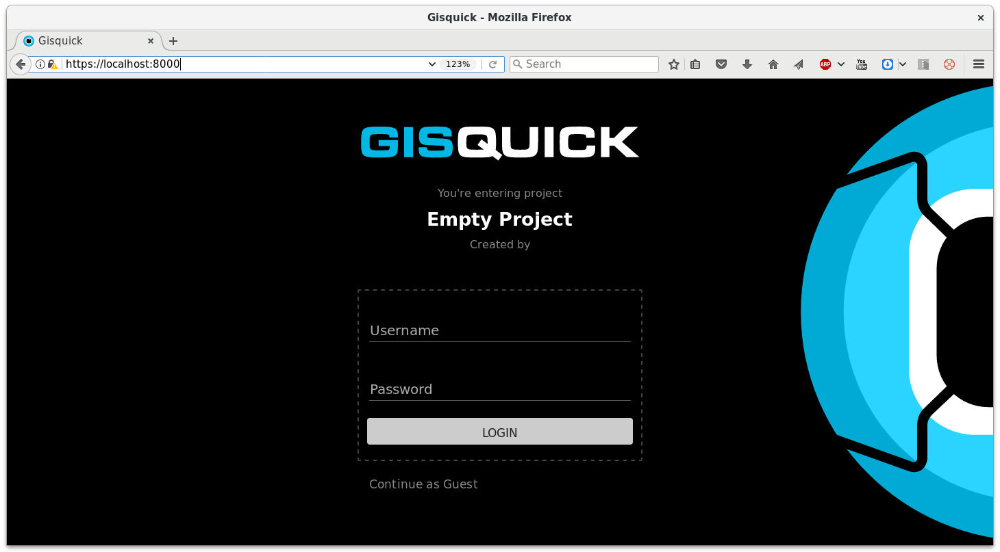

Deploying testing environment
=============================

After :ref:`downloading Gisquick source code <source-code>`, go to
newly created :file:`gisquick` directory and deploy virtual server
providing Gisquick service.

.. note:: |note| Default configuration is stored in
   :file:`provision/group_vars/all`. Custom user configuration can be
   defined in :file:`provision/host_vars/gisquick`. In this file can
   be optionaly enabled Gisquick experimental mobile client by adding
   configuration variable as ``GISLAB_CLIENT_MOBILE: yes``.

Virtual server can be deployed using ``vagrant`` command. This
operation requires to install `Vagrant
<https://www.vagrantup.com/>`__, `VirtualBox
<http://virtualbox.org>`__, and `Ansible <http://ansible.org/>`__ on
host machine.

.. note:: |note| Minimum version of Ansible is 2.0 and higher, see
   `instructions
   <http://gislab.readthedocs.io/en/latest/installation/configuration.html#installation-of-requirements>`__
   for installing software requirements in GIS.lab documentation.

To deploy virtual server called ``gisquick`` run:

.. code-block:: sh
   :emphasize-lines: 1
                  
   $ vagrant up

   Bringing machine 'gisquick' up with 'virtualbox' provider...
   ==> gisquick: Importing base box 'trusty-canonical-32'...
   ...
   ==> gisquick: Running provisioner: install (ansible)...
    gisquick: Running ansible-playbook...
   ...
   PLAY RECAP *********************************************************************
   gisquick                   : ok=4    changed=0    unreachable=0    failed=0

.. tip:: |tip| To speed up provisioning using *Apt proxy server*, set
   ``APT_PROXY`` variable before running above command like ``$ export
   APT_PROXY=http://192.168.99.118:3142``. Check `instructions
   <http://gislab.readthedocs.io/en/latest/general/tips.html#apt-cacher-service>`__
   how to set up Apt proxy server in GIS.lab documentation. Thanks to
   that, with next installation of server it can be faster because
   software packages will have not to be downloaded again.

After succesfull deployment, created virtual machine can be accessed
via ``ssh`` vagrant command (must be called also from source code root
:file:`gisquick` directory).

.. code-block:: sh
   :emphasize-lines: 1
   
   $ vagrant ssh

   Welcome to Ubuntu 14.04.4 LTS (GNU/Linux 3.13.0-83-generic i686)
   
    * Documentation:  https://help.ubuntu.com/
   
    System information disabled due to load higher than 1.0
   
     Get cloud support with Ubuntu Advantage Cloud Guest:
       http://www.ubuntu.com/business/services/cloud
   
   
   Last login: Wed Apr 13 08:49:28 2016 from X.X.X.X

Development services can be started using ``tmux-dev.sh`` command
called from server prompt.

.. code-block:: sh
   :emphasize-lines: 1

   vagrant@gisquick:~$ /vagrant/utils/tmux-dev.sh 
   
   ──────────────────────────────────────────────────────────────────────────────────────────────────────────────────────────────────────────
   System    check identified no issues (0 silenced).
   May 01, 2016 - 22:17:09
   Django version 1.8.9, using settings 'devproj.settings'
   Starting development server at https://localhost:8000/
   Using SSL certificate: /home/vagrant/.virtualenvs/gisquick/local/lib/python2.7/site-packages/sslserver/certs/development.crt
   Using SSL key: /home/vagrant/.virtualenvs/gisquick/local/lib/python2.7/site-packages/sslserver/certs/development.key
   Quit the server with CONTROL-C.
   
   ─────────────────────────────────────────────────────────────────────┬────────────────────────────────────────────────────────────────────
   sudo tail             -n 0             -f /var/log/lighttpd/access.lo│sudo tail             -n 0             -f /var/log/lighttpd/qgis-map
   g /var/log/lighttpd/error.log                                        │server.log
   vagrant@gisquick:~$ sudo tail             -n 0             -f /var/│vagrant@gisquick:~$ sudo tail             -n 0             -f /var
   log/lighttpd/access.log /var/log/lighttpd/error.log                  │/log/lighttpd/qgis-mapserver.log
   ==> /var/log/lighttpd/access.log <==                                 │
                                                                        │
   ==> /var/log/lighttpd/error.log <==                                  │
                                                                        │

   [developme 0:servers*                                                                                         "gisquick" 20:17 01-May-16 

Afterwards Gisquick can be accessed on https://localhost:8000.
 

Development services can be stopped from server terminal by ``tmux``
command.

.. code-block:: sh

   vagrant@gisquick:~$ tmux kill-session 

After logout, running virtual server can be shutdown by

.. code-block:: sh

   $ vagrant halt

Halted machine can be launched again by ``vagrant up`` command.

.. note:: To destroy virtual machine and delete all related files type

   .. code-block:: sh

      $ vagrant destroy -f

Running virtual machine can be updated by

.. code-block:: sh

   $ vagrant provision

   
