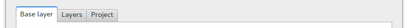
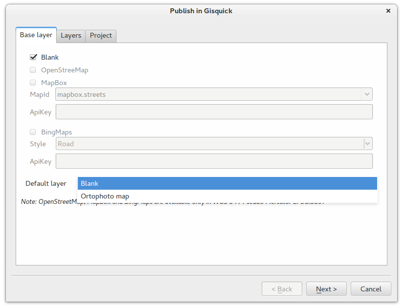
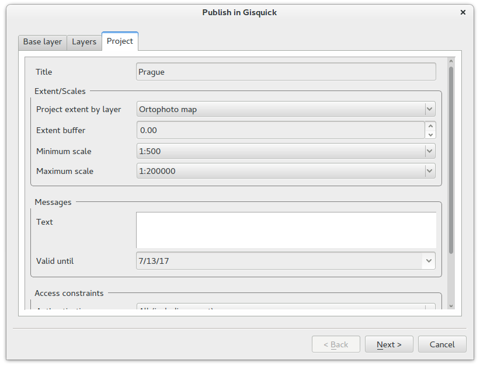
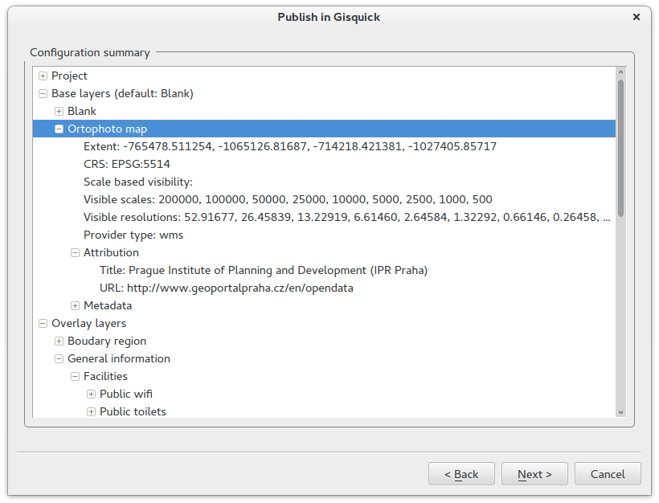
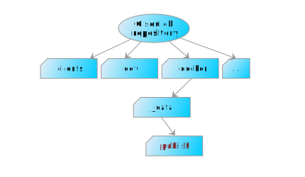

.. |plugin| image:: ./img/logo.png
   :width: 2.5em

.. _project-publishing:
 
==================
Project publishing
==================

It is assumed that Gisquick application is running on the server, see
:doc:`../installation/vagrant` or :doc:`../installation/docker`. This
section shows QGIS project publishing process. It is required to
install on the client machine `QGIS Desktop
<http://qgis.org/en/site/forusers/download.html>`__ and :doc:`Gisquick
plugin <../installation/plugin>`.

QGIS project dedicated for publishing is prepared in the standard
way. Map layers can be combined from various data sources, like flat
files (Esri Shapefile, GML), file-based databases (SQLite,
SpatiaLite), server-client-based databases (PostGIS), or OGC Web
Services (WMS, WFS, WCS).

Before publishing using Gisquick plugin, the project must be saved.

.. important:: |imp| When using flat files or file-based databases as
   data stores it is recommended to save all the files (data and QGIS
   project) in the same directory. QGIS project must be set up to use
   **relative** paths (see *Project Properties*).

   When using any kind of authentatization (databases, web services)
   it must be ensured that server used for publishing will have access
   to such data sources.

Publishing QGIS project will be demostrated on :ref:`Prague sample
project <dataset-prague>` downloadable as as `zip file
<http://training.gismentors.eu/geodata/gisquick/prague.tar.gz>`__. At
first, sample :file:`prague.qgs` QGIS project will be open in QGIS
Desktop. Before doing any changes we try to publish the project as it
is.

.. figure:: ./img/qgis-prague.png

   Prague sample project loaded in QGIS.

Publication process is started by Gisquick QGIS plugin
|plugin|. Plugin is designed as simple wizard which helps simplifying
publishing process as much as possible.

First page of the wizard allows defining basic settings for publishing:

* **base layers**,
* **overlay layers**, and
* basic **project metadata**

.. _publication-base-layers:

By **base layers** are meant typically WMS layers provided by QGIS
project. ``Base layer`` subpage also allows adding base layers provided by
external services like OpenStreetMap, MapBox or Bing.

.. important:: |imp| External base layers are available only when QGIS
   project is using WGS84 Pseudo Mercator projection (EPSG:3857).

Here also default base layer can be defined, see figure below.

In the second ``Layers`` subpage is controlled, simply by checkboxes,
which map layers will be published. It's also possible to publish
layer as hidden (ie. not shown in ``Overlay layers`` tab, see
:doc:`user-interface`). Top-left checkbox ``Use cached`` controls
usage of QGIS Server map cache. By default, overlay layers tiles are
cached by QGIS server and re-used when possible.
            
.. figure:: ./img/project-publishing-2.png

.. _publication-metadata:

The last ``Project`` subpage allows defining basic project metadata
like title, extent, min/max scales, info message, access constraints,
etc.
            

.. _publication-topics:

In the following page **topics** can be defined. By topic it's meant
group of thematically-related overlay layers. Topics can be easily
switched in ``Topics`` tab of Gisquick UI, see :doc:`user-interface`
section. Layers which should be part of defined topic are simply
checked. Topics can be added or removed by buttons localed in
bottom-left part of the dialog. Each topic has defined short
description (abstract) which is shown by Gisquick UI.
            
.. figure:: ./img/project-publishing-4.png

Last but one page showns read-only **configuration summary**. It's last
chance to go back by ``Back`` button and change publication settings.
            

On the last page are displayed files which needs to transfered to the
server providing Gisquick publication platform, see
:doc:`installation/index` section. The result of publication proccess
are two generated files: timestamped QGIS project (``.qgs``) and
metafile (``.meta``). These files are data (see ``Data sources``) must
be transfered to the publication server.
            
.. figure:: ./img/project-publishing-6.png            

.. _plugin-publish-directory:
   
When ``Publish`` button is pressed, unique project file name with
timestamp together with it's metafile are created. By default,
timestamped files are created in the same directory as original QGIS
project. The destination file can be changed by ``Change`` button. In
this case data source files are also copied to the newly defined
directory.

Transfering project to publication server
-----------------------------------------

In this section is described finishing publication process,
transfering published project to the publication server. Destination
folder on the server can be different depending on installation
process.

When Gisquick is provided by **virtual server** controlled by Vagrant,
see :doc:`installation/vagrant`, the generated timestamped files are
copied to :file:`dev/publish` directory located in Gisquick source
code tree from which virtual machine has been provisioned, see
:ref:`directory layout <vagrant-dev-dir>`.

.. figure:: img/vagrant-directory.svg
   :align: center
   :width: 450

   Publish directory for virtual server controlled by Vagrant.

In the case of **Docker-based** installation, see
:doc:`installation/docker`, the publication directory is defined by
:file:`docker-compose.yml` configuration file. In the presented
:ref:`example <docker-publish-dir>` publication directory is located
in Gisquick source tree :file:`docker/_data/publish`.

   Publish directory provided by Docker containers.

Projects in the *publish* directory are split into subdirectories
corresponding registered users, see
:doc:`./installation/user-management` section. In the case of virtual
server it's possible to use predefined :ref:`vagrant user
<vagrant-user>`.

.. figure:: img/publish-directory.svg
   :align: center
   :width: 450

   Publish directory provided by Docker containers.

.. seealso:: ``|see| See also :ref:`Source code layout
   <source-code-layout>`.
                
.. important:: |imp| When user directory is not available in
   :file:`publish` directory it's necessary to create it.

Then it is necessary to **copy** published QGIS project (including
timestamped files) with all associated data to user publish directory,
eg. :file:`dev/publish/vagrant` or :file:`docker/_data/publish/user1`
directory located in :file:`gisquick` source code tree. In our
example, the project will be copied into
:file:`dev/publish/vagrant/prague` directory.

.. tip:: |tip| Instead of copying project files it is also possible to
   define this output directory directly by :ref:`Gisquick plugin
   <plugin-publish-directory>`. In this case the publish directory
   must be accessible by clients via Network File System, FTP, or SSH.

Published project is possible to access by URL formed by server name
(https://localhost:8000 in the case of virtual server), user name,
project directory and QGIS project file name, see URL below.
   
.. code:: 

   https://localhost:8000?PROJECT=<user-name>/<project-directory-name>/<qgs-file-name>

As the final step, open web browser and launch published project in
Gisquick interface by entering URL, in our case
eg. https://localhost:8000?PROJECT=vagrant/prague/prague.qgs.

.. _guest-session:

You will see welcome screen with possibility to enter credential
(*vagrant/vagrant* or other used user account) but for now, you can
just ``Continue as guest``.

.. _gisquick-welcome:

.. figure:: img/gisquick-welcome.png
   :align: center
   :width: 750

   Gisquick welcome screen.

And now there are no obstacles to enjoy your published project.

.. _gisquick-we-published:

.. figure:: img/gisquick-published.png
   :align: center
   :width: 750

   QGIS project published with Gisquick.
