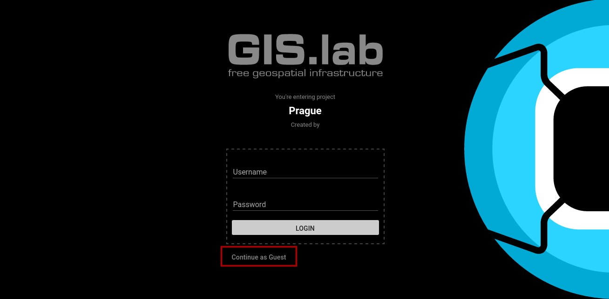
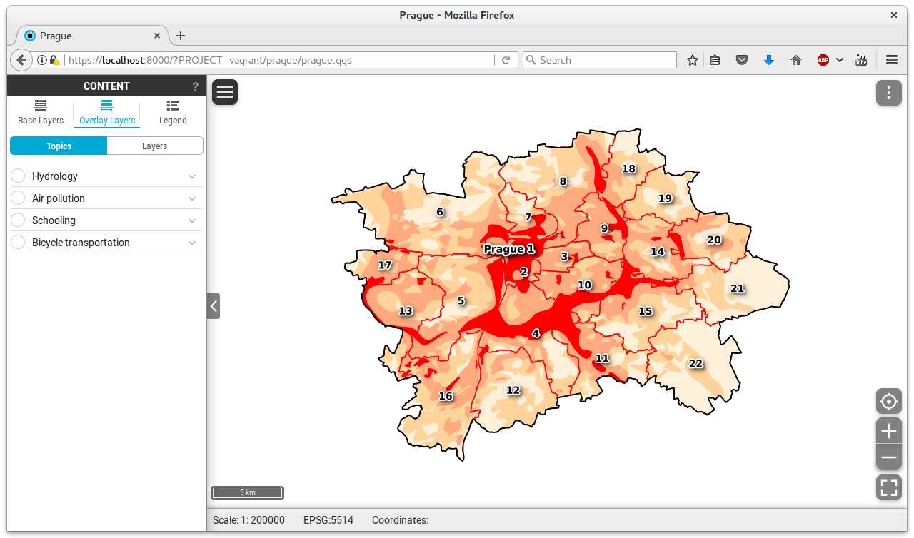

.. |plugin| image:: ./img/logo.png
   :width: 2.5em

.. _project-publishing:
 
==================
Project publishing
==================

It is assumed that Gisquick application is running on the server, see
:doc:`../installation/vagrant` or :doc:`../installation/docker`. This
section shows QGIS project publishing process. It is required to
install on the client machine `QGIS Desktop
<http://qgis.org/en/site/forusers/download.html>`__ and :doc:`Gisquick
plugin <../installation/plugin>`.

QGIS project dedicated for publishing is prepared in the standard
way. Map layers can be combined from various data sources, like flat
files (Esri Shapefile, GML), file-based databases (SQLite,
SpatiaLite), server-client-based databases (PostGIS), or OGC Web
Services (WMS, WFS, WCS).

Before publishing using Gisquick plugin, the project must be saved.

.. important:: |imp| When using flat files or file-based databases as
   data stores it is recommended to save all the files (data and QGIS
   project) in the same directory. QGIS project must be set up to use
   **relative** paths (see *Project Properties*).

   When using any kind of authentatization (databases, web services)
   it must be ensured that server used for publishing will have access
   to such data sources.

Publishing QGIS project will be demostrated on :ref:`Prague sample
project <dataset-prague>`. At first, sample :file:`prague.qgs` QGIS
project will be open in QGIS Desktop. Before doing any changes we try
to publish the project as it is.

.. figure:: ./img/qgis-prague.png

   Prague sample project loaded in QGIS.

Publication process is started by Gisquick QGIS plugin
|plugin|. Plugin is designed as simple wizard which helps simplifying
publishing process as much as possible.

When ``Publish`` button is successfully pressed in GIS.lab QGIS plugin
:ref:`dialog <gisquick-qgis-plugin-publish>`, 
unique project file name with timestamp together with it's metafile are created.

Then it is necessary to **copy** published QGIS project with all associated data 
to ``vagrant`` directory that is located in ``gisquick`` source code.

.. figure:: img/vagrant-directory.svg
   :align: center
   :width: 450

   Directory for QGIS projects going to be published.

.. seealso:: |see| :ref:`Source code layout <source-code-layout>`

As the final step, open web browser and launch published project in Gisquick 
interface by entering URL below.
You will see welcome screen with possibility to enter credential but for now, 
you can just ``Continue as guest``. 

.. code:: 

   https://localhost:8000?PROJECT=vagrant/<project-directory-name>/<qgs-file-name>

.. _gisquick-welcome:

   Gisquick welcome screen.

And now there are no obstacles to enjoy your published project.

.. _gisquick-we-published:

   QGIS project published with Gisquick.

.. seealso:: |see| See :ref:`Publish project on web <practice-gisquick-publishing>`
   section with publishing QGIS projects from GIS.lab Desktop environment.

Type ``tmux kill-session`` to destroy the given session, closing any windows 
linked to it and no other sessions, and detaching all clients attached to it.
Then use ``logout`` to log out from virtual 
machine and ``vagrant halt`` to shut down the running machine Vagrant 
is managing.

.. tip:: |tip| Use following command to run server tests from 
   ``/vagrant/dev/django`` directory.

   .. code:: sh

      $ python ./manage.py test webgis.viewer.tests

.. note:: |note| QGIS Mapserver is also forwarded to host machine on port ``8090``.
   Its logs can be found in ``/var/log/lighttpd`` directory.

