.. |group-switcher| image:: ./img/ui-layer-group-switcher.png
   :width: 2.5em
.. |layer-attributes| image:: ./img/ui-layer-attributes.png
   :width: 2.5em
.. |zoom-to| image:: ./img/ui-zoom-to.png
   :width: 2.5em

.. |zoom-in-out| image:: ./img/ui-zoom-tools-in-out.png
   :width: 2.5em
.. |zoom-extent| image:: ./img/ui-zoom-tools-extent.png
   :width: 2.5em

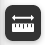

 
================
 User Interface
================

The Gisquick clients are designed with a goal to put together minimal
set of functions for useful generic responsive web and mobile friendly
mapping application.

The major part of the clients User Interface (UI) is occupied by *map
canvas* (``1``). On the left side is located :ref:`content management
tools <content-menu>` (``2``) which is possible to hide by button on
its right side (``3``). Corners of map canvas are filled by (from
left-bottom corner, clockwise) by *map scale* (``4``), :ref:`tools
<tool-menu>` (``5``), :ref:`user menu <user-menu>` (``6``) and
:ref:`zoom tools <zoom-menu>` (``7``). In the bottom part is located
statusbar showing current scale, projection and map coordinates of the
cursor (``8``).

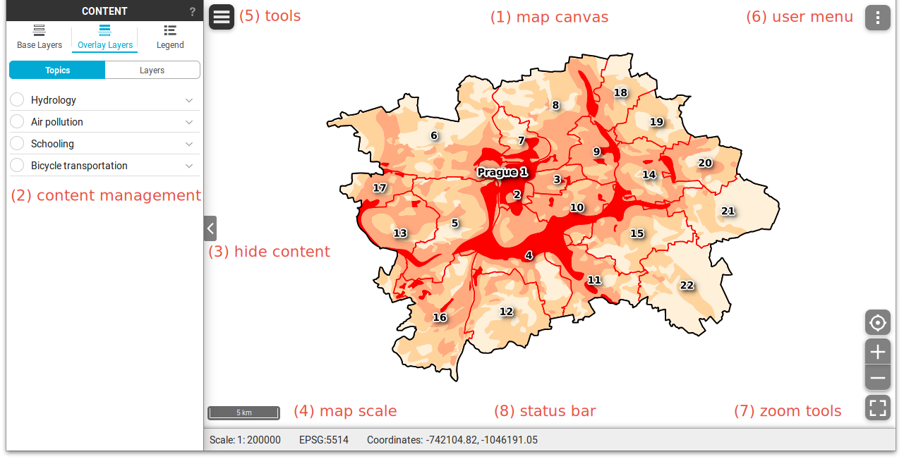

   Gisquick user interface description.

.. _content-menu:

Content management tools
========================

Basic project metadata - project description - is accessible by
question-mark, see figure below.

.. figure:: ./img/project-info.svg

   Project description.

Content management widget is split into three major tabs:

* **Base Layers**
* **Overlay Layers**
* **Legend**

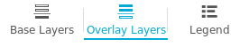
           
   Content tabs.

``Base Layers`` tab allows switching base layers in map canvas. The
list of base layers is defined by publication process as described in
:ref:`Project publishing <publication-base-layers>` section.

.. figure:: ./img/ui-base-layers.png
   :width: 250px
           
   Switching between base layers.
     
``Overlay Layers`` tab allows switching between topics (layer groups),
see :ref:`Project publishing <publication-topics>` section, or
controlling overlay layers one by one.

.. figure:: ./img/ui-overlay-layers.png
   :width: 250px
           
   Topics and layers switcher.

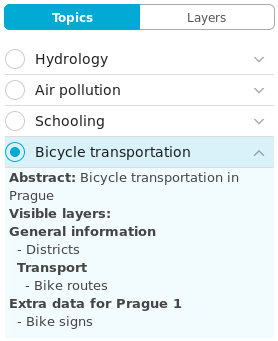
           
   Switching between topics.

In ``Layers`` mode the overlay layers can be switch on/off one by one.

.. figure:: ./img/ui-map-layers.png
   :width: 250px
           
   Switch on/off overlay layers.

.. tip:: |tip| It is also possible to switch on/off group of layers
   |group-switcher|.

.. todo:: Explain legend.

Attribute data
--------------

In ``Layers`` mode attribute data can be accessed by
|layer-attributes|. Attribute table is displayed in bottom part, see
figure below.

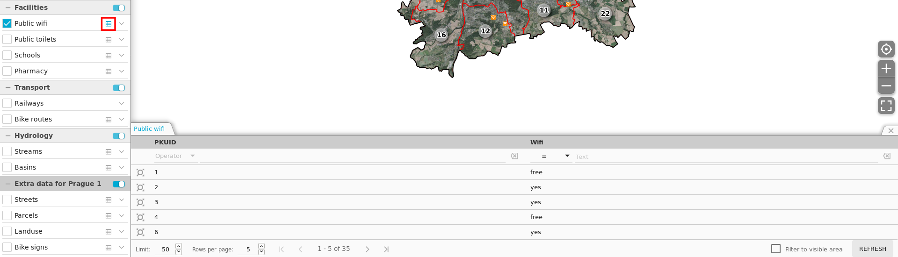

   Layer attribute table.

Attribute table allows filtering data based on simple queries, see
figures below.

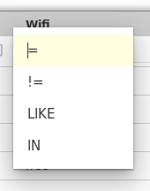
           
   Choose operator for attribute filter.

.. figure:: ./img/ui-attribute-filter-1.svg

   Define filter and ``refresh`` attribute table view.

.. tip:: |tip| By default, attribute table shows only few rows. The
   number of displayed rows can be controlled in status bar by ``Rows
   by page``. Attributes can be also filter by map canvas ``Filter to
   visible area``.

Every row in attribute table has *Zoom to* button |zoom-to| which
enables zooming and centering related features in map canvas, see
figure below.

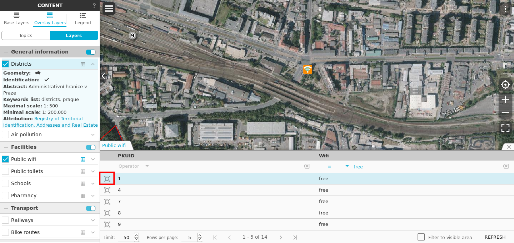

   Zoom into selected feature.

.. note:: Attribute filter can be disabled by |clear-filter|. Table
          view must be refreshed.

.. todo:: Explain info panel.
          
.. _zoom-menu:

Zoom tools
==========

Zoom tools enables controlling map view.

* Geolocation |zoom-geolocation|
* Zoom in/out |zoom-in-out|
* Zoom to extent |zoom-extent|

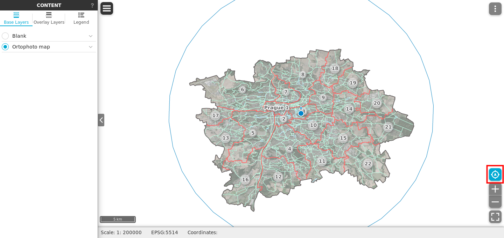

   Geolocation in action.

.. tip:: Zooming and panning is also possible by middle mouse button.
   
.. _tool-menu:

Tools
=====

Two basic tools are available:

* Identify |identify|, and
* Measurement |measure|

Identify
--------

By default, features are identified in all visible layers (in the
example below in Schools and District layers).

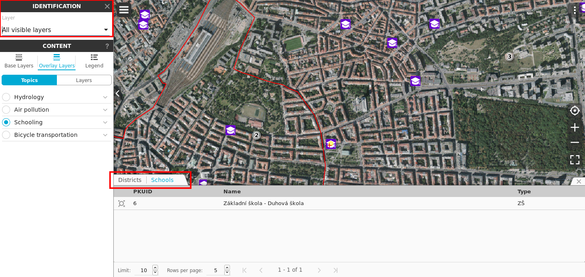

   Identify schools and district layer.

This settings can be changed in ``Identification`` combo box.

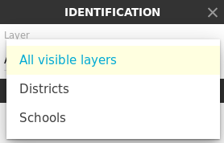
      
   Change layer priority for identification.

Measurement
-----------

Three measurement modes are available:

* Location (point coordinates)
* Distance
* Area

.. figure:: ./img/ui-measure-tools.png
   :width: 250px
   
   Measurement tools.

.. figure:: ./img/measure-location.svg

   Location measurement example. Menu highlighted in red box.

Location menu allows:

* Zoom to location
* Change spatial reference system. By default two system are
  supported: QGIS project system and WGS-84 (EPSG:4326) known as "GPS
  coordinates".

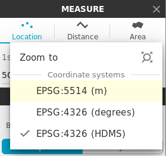
           
   Location menu.

.. figure:: ./img/measure-distance.svg

   Distance measurement example. Menu highlighted in red box.

Distance menu allows:

* Zoom to distance
* Change units. Currently two systems are supported: international
  (EU) and imperial (UK, US)

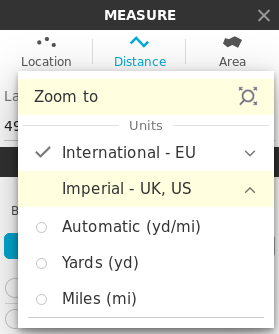
           
   Distance menu.

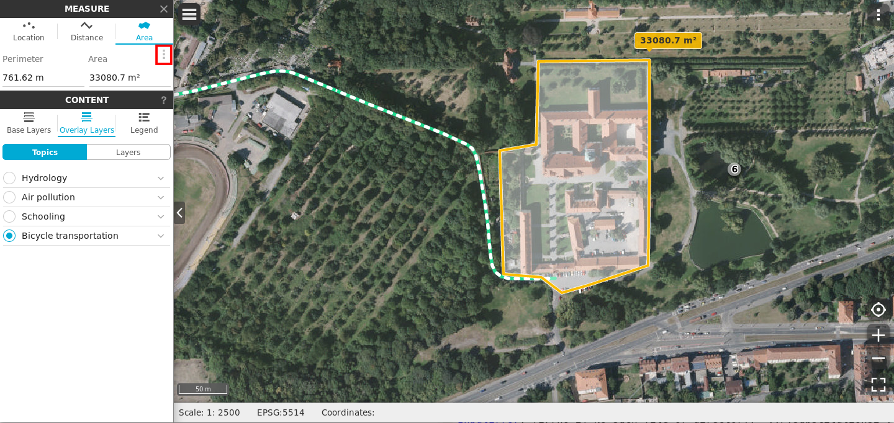

   Area measurement example. Menu highlighted in red box.

Area menu allows:

* Zoom to distance
* Change units. Currently two systems are supported: international
  (EU) and imperial (UK, US)

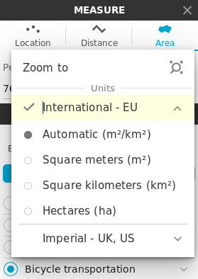
           
   Area menu.

.. note:: Currently **no snapping** to features is supported by
          measurement tools.

.. _print-tool:

Print tool
----------

|print| The main idea is, that once print is activated in Gisquick, it
means that before :doc:`project publication <project-publishing>` is
defined map composer in QGIS Desktop, it will download raw print
output from QGIS Server using GetPrint request and will allow
interactive visualization of map content directly in this template.
One can zoom, pan and rotate map and see exactly how the result will
look like.  To get the better idea, see video below.

.. raw:: html

   
<iframe width="560" height="315" src="https://www.youtube.com/embed/1g0YduhPwpk" frameborder="0" allowfullscreen></iframe>

   

.. important:: |imp| Print tool in Gisquick is not accessible in
   :ref:`Guest session <guest-session>`, only log in users can use
   this tool.

.. _user-menu:
   
User menu
=========
         
User menu allows to:

* Log out current user
* Enter/Leave Full Screen mode
* Display attributions
* Show Help (this document)
* Show Project About (see :ref:`Project publishing
  <publication-metadata>` section)

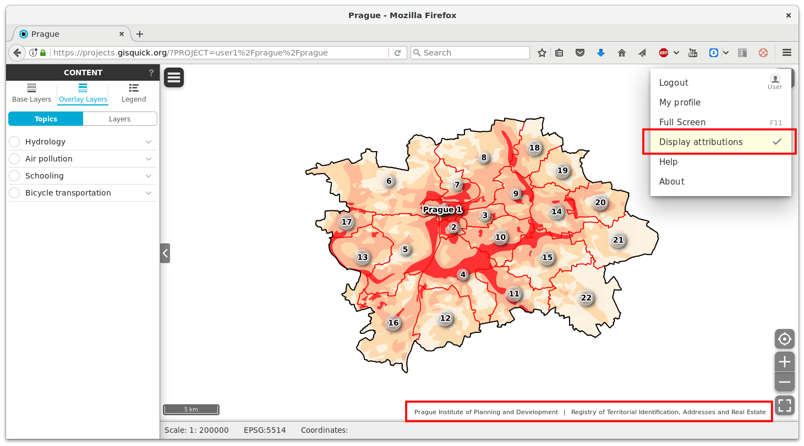

   Map attributions displayed.
   
.. figure:: ./img/about-window.png
   :width: 300px
   
   About window showing information about Project and Gisquick itself.

.. todo:: Explain User Profile.
