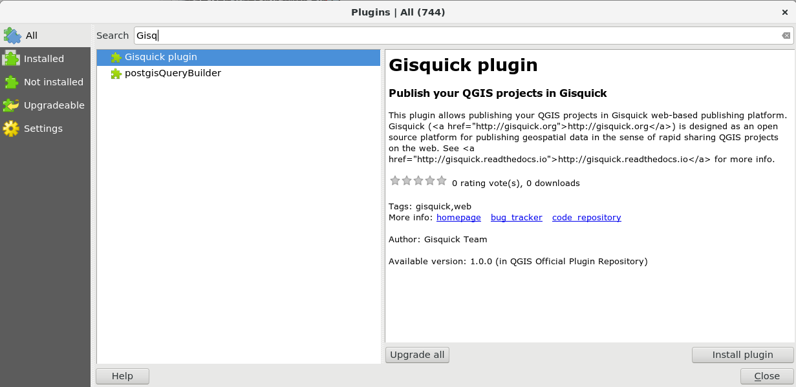

QGIS plugin
===========

Very important part of Gisquick publishing platform is represented by
**Gisquick QGIS plugin**. Gisquick plugin builds Gisquick bundle from
any QGIS desktop project. It allows adding base layers, creating
topics from layers list, setting access constraints or project
expiration.

Source code of the plugin is available from GitHub
`gisquick-qgis-plugin
<https://github.com/gislab-npo/gisquick-qgis-plugin>`_ repository and
licensed under `GNU General Public License
<https://github.com/gislab-npo/gisquick-qgis-plugin/blob/master/LICENSE>`__
version 2 or later.

Plugin can be installed in QGIS Desktop from :menuselection:`Plugins
--> Manage and Install Plugins` as other QGIS plugins.

.. important:: |imp| Currently Gisquick plugin **is not** available
   from QGIS Plugins Repository. Therefore is necessary to register
   new repository, see URL bellow

   ::
      
      https://raw.githubusercontent.com/gislab-npo/gisquick-qgis-plugin/gh-pages/qgis-plugins.xml

   .. figure:: ../img/installation/qgis-plugin-repo.png

      Add Gisquick repository.

   Install Gisquick QGIS plugin.
               
After successful installation, a new icon should appear in QGIS
plugin toolbar.

.. _gisquick-qgis-plugin-logo:

.. figure:: ../img/logo.png
   :align: center
   :width: 64

   Gisquick QGIS plugin icon.
