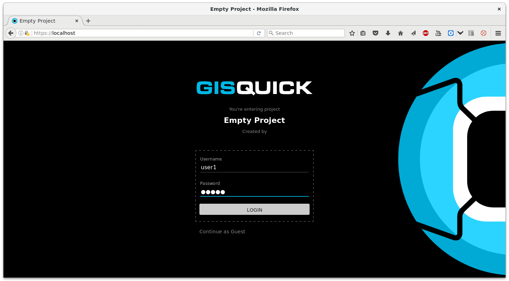
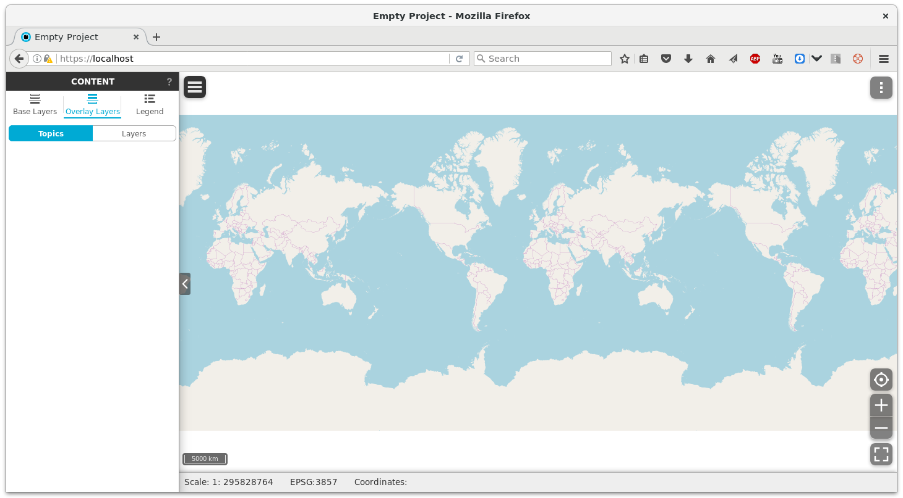

User management
===============

Currently user accounts can be managed only manually from Django
shell.

At first, log in to Gisquick Django application server. The following
command will identify Django container and enter Django shell.

.. code-block:: bash
                
   $ docker exec -it `docker ps -qf "ancestor=gisquick/django"` django-admin shell

.. _create-account:

Create new user account
-----------------------

After entering Django shell, a new user account can be created
programmatically (in example below a new account ``user1`` with
password ``user1`` will be created)

.. code-block:: python
                
   from django.contrib.auth import get_user_model
   get_user_model().objects.create_user('user1', email='user@gisquick.org',
                                        password='user1', first_name='User1')

To quit Django shell type

.. code-block:: python

   exit()

Then the new user can log in into Gisquick application.

   Log in as *user1*.

After log in an empty Gisquick project is loaded. 

   Empty Gisquick project. OpenStreetMap is used as a base layer.

