.. _project-publishing:

==================
Project publishing
==================

This section explains the process of publishing QGIS map project. It is
assumed that `QGIS Desktop
<http://qgis.org/en/site/forusers/download.html>`__ together with
:doc:`Gisquick plugin <../administrator-manual/installation/plugin>`
is installed on the user machine.

It is also assumed that Gisquick platform is running on the
**publication server**. Such server can be run on your own hardware or
in cloud services, see
:doc:`../administrator-manual/installation/docker` section for
details.

.. tip:: |tip| Gisquick provides ready-to-use **demo publication server**
   available at https://projects.gisquick.org, freely available for
   experiments and testing.
   
QGIS project dedicated for publishing is prepared in the standard
way. Map layers can be combined from various data sources like flat
files (Esri Shapefile, GML), file-based databases (SQLite,
SpatiaLite), server-client databases (PostGIS) or OGC Web Services
(WMS, WFS, WCS).

Before publishing project using Gisquick plugin, the project must be
saved.

.. important:: |imp| When using flat files or file-based databases as
   data stores it is recommended to save all the files (data and QGIS
   project) in the same directory. QGIS project must be set up to use
   **relative** paths (see *Project Properties*).

   When using any kind of authentication (databases, web services) it
   must be ensured that server used for publishing will have access
   rights to such data sources.

Publishing QGIS project will be demonstrated on the :ref:`Prague sample
project <dataset-prague>` downloadable as a `zip file
<http://training.gismentors.eu/geodata/gisquick/prague.tar.gz>`__. At
first, sample :file:`prague.qgs` QGIS project is open in QGIS
Desktop. Before doing any changes the project will be published as it
is.

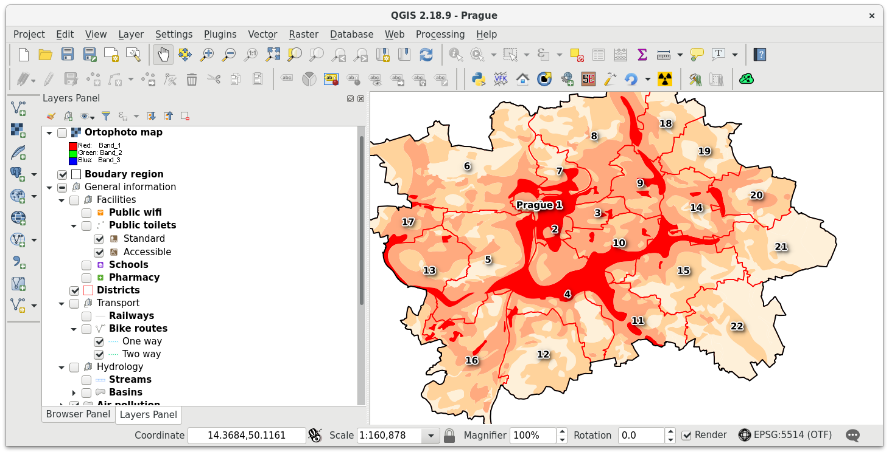

   Prague sample project loaded in QGIS.

The publication process is started by Gisquick QGIS plugin
|plugin|. The plugin is designed as a wizard to simplify publishing
process as much as possible.

First page of the wizard allows defining basic settings for publishing:

* **base layers**,
* **overlay layers** and
* basic **project metadata**.

.. figure:: ../img/project-publishing-0.png

.. _publication-base-layers:

By **base layers** are meant typically WMS layers provided by QGIS
project. The ``Base layer`` sub-page also allows adding base layers provided by
external services like OpenStreetMap, MapBox or Bing.

.. important:: |imp| External base layers are available only when QGIS
   project is using WGS84 Pseudo Mercator projection (EPSG:3857).

Here also default base layer can be defined, see figure below.

.. figure:: ../img/project-publishing-1.png

In the second ``Layers`` sub-page is controlled, simply by
checkboxes, which map layers will be published. It's also possible to
publish layer as hidden (ie. not shown in ``Overlay layers`` tab, see
:doc:`./user-interface` section). Top left checkbox ``Use cache``
controls usage of QGIS Server map cache. By default, map tiles are
cached by QGIS server and re-used when possible.
            
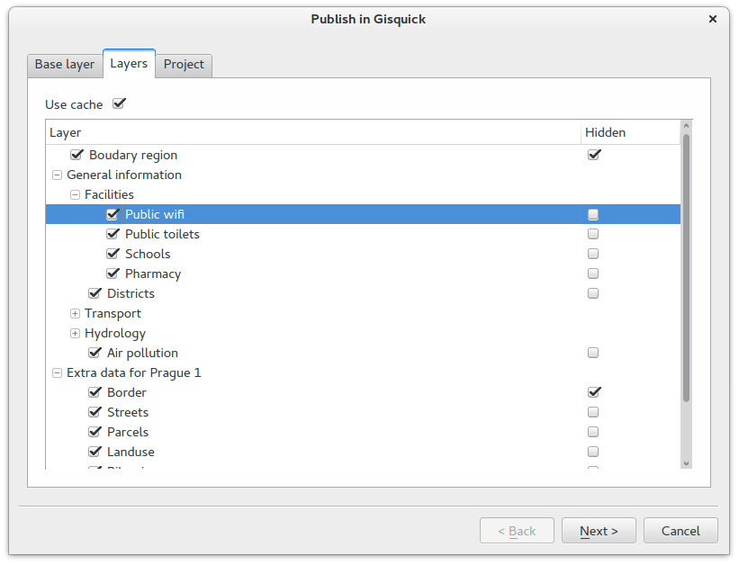

.. _publication-metadata:

The last ``Project`` sub-page allows defining basic project metadata
like title, extent, min/max scales, info message, access constraints,
etc.
            
.. figure:: ../img/project-publishing-3.png                        

.. _publication-topics:

In the following page **topics** can be defined. By topic it's meant
a group of thematically-related overlay layers. Topics can be easily
switched in ``Topics`` tab of Gisquick UI, see
:doc:`./user-interface` section. Layers which
should be part of a defined topic are simply checked. Topics can be
added or removed by buttons located in the bottom left part of the
dialog. Each topic has defined a short description (abstract) which is
shown by Gisquick UI.
            
.. figure:: ../img/project-publishing-4.png

Last but one page shows a read-only **configuration summary**. It's the last
chance to go back by ``Back`` button and change publication settings.
            
.. figure:: ../img/project-publishing-5.png

On the last page are displayed files need to be transferred to the
Gisquick publication server. The result of publication process is two
generated files: timestamped QGIS project (``.qgs``) and metafile
(``.meta``). These files together with project data (see ``Data
sources``) must be transferred to the publication server.
            
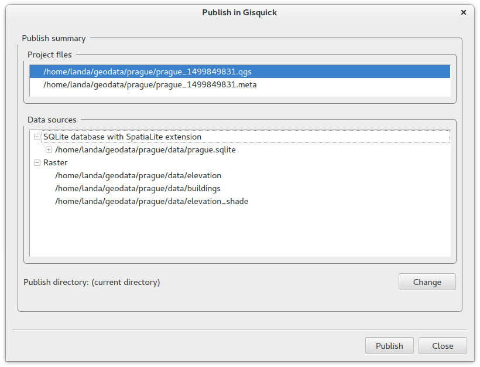

.. _plugin-publish-directory:
   
When ``Publish`` button is pressed, the unique project file name with
timestamp together with its metafile is created. By default,
timestamped files are created in the same directory as the original QGIS
project. Optionally the destination directory can be changed by the
``Change`` button. In this case, data source files are also copied to
the newly defined directory.

The published project together with data can be optionally zipped into an
archive, which can be easily uploaded to the publication server, see
``Create project zip file for upload`` option.

Transferring project to publication server
------------------------------------------

The publication process is finished by transferring a project to the
publication server. The procedure will be explained on the **demo
publication server** (https://projects.gisquick.org).

.. note:: |note| The publication procedure can differ when running own
   Gisquick instance.

First of all, a new user account must be created on a publication
server. This can be done easily by filling the registration form available
at https://projects.gisquick.org/accounts/signup/.

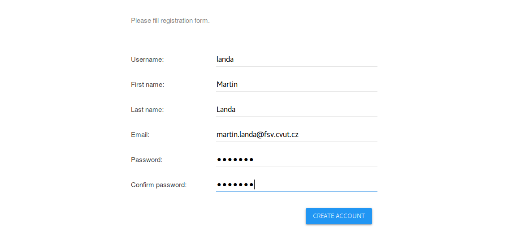

   Registration form for creating a new user account.

After pressing ``CREATE ACCOUNT`` button a confirmation mail should
be send to a given e-mail address.

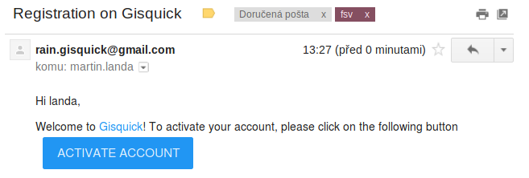

   Completion of registration process will be done by pressing
   ``ACTIVATE ACCOUNT`` button.

Afterwards, a new user is notified about successfull singing-in.

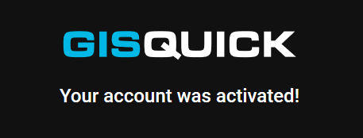

   A new user account has been successfully created.

After clicking on ``CONTINUE`` button a new user will be redirected to
the publication server welcome screen.

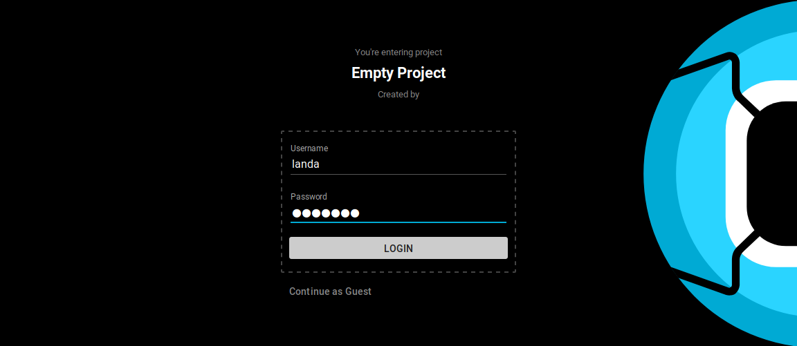

   Gisquick login screen.

The user can login using credentials (user name and password). After
login Gisquick loads user's welcome page which includes list of already
published projects. After the very first login or in case that user hasn't
published any project yet, only the message appears stating how to proceed.

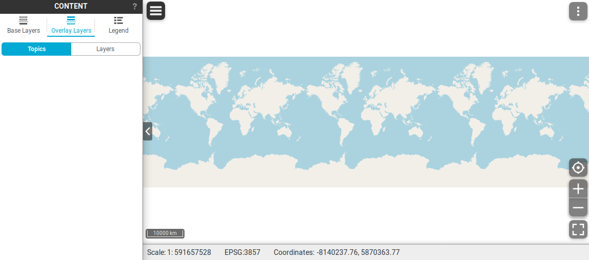

   User's welcome page after first login.

In the next step, the user can upload a prepared project zip file created
by Gisquick plugin as described in the section above. In the user menu go
to ``My profile`` (see :ref:`User profile page <user-profile-page>`
for details). Go to ``Upload project``, enter the project zip file and
upload the file using the ``Upload`` button.

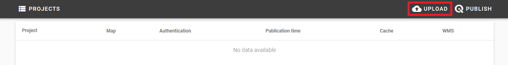

   Upload project zip file.

After successful upload go to ``My Projects`` and find your first
published project.

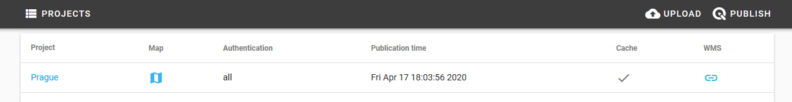

   List of user's published projects.

Click on the blue map icon in the second column and enjoy Gisquick!

.. _gisquick-we-published:

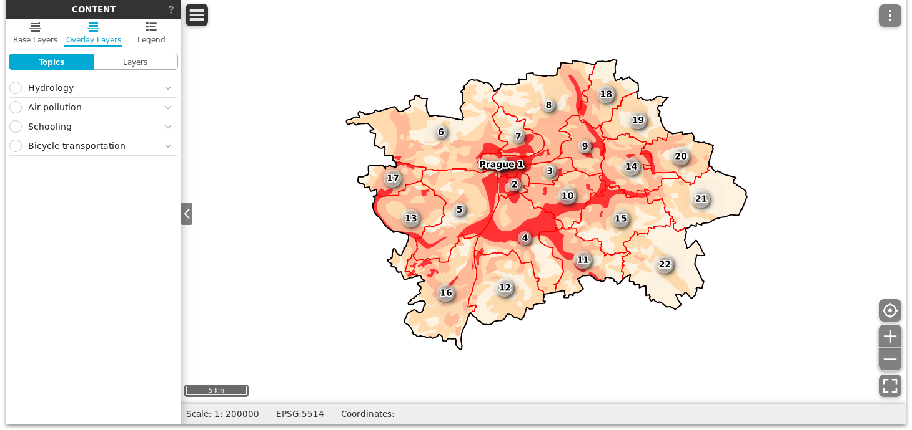

   QGIS project published with Gisquick.

Experimental publishing
-----------------------
Another so-called 'experimental' option how to publish project is desscribed
in this part. Firstly, click on ``Publish`` button which is situated next to the
``Upload`` button in the user's project page. It allows to publish a project
directly from QGIS. In order to use this alternative, QGIS plugin needs to be
installed and connected. Required plugin is available to download for 64-bit OS
(Windows, Linux, Darwin).

.. figure:: ../img/publish-button/publish-button-1.png

   Placement of publish button.

.. figure:: ../img/publish-button/publish-button-2.png
   :width: 75%

   Where to download plugin for direct publishing from QGIS.

Once the download is complete, open QGIS and find tab ``Plugins`` and
choose ``Manage and install plugins``. Continue to the ``Install from
zip`` tab, set path to the downloaded zip file and hit install button.

.. figure:: ../img/publish-button/publish-button-3.png
   :width: 75%

   How to proceed in QGIS to install the experimental plugin.

When the installation is finished, it is possible to check new acquisition
in the list of installed plugins. Also, new icon appears in QGIS ribbon.
In comparison with classic Gisquick icon, it only differs in small digit 2
in the middle.

.. figure:: ../img/publish-button/publish-button-4.png
   :width: 75%

   List of installed plugins.

Next step is to prepare the project in QGIS. Once the project is ready,
click on experimental Gisquick plugin logo. For the very first time,
Gisquick asks user to fill in the connection and Gisquick login details.

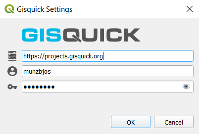

   Example of filled connection and login details.

After succesfull check-in to the Gisquick server, the project is screened
in user's experimental publish window. Notice, that the Gisquick 2
icon stays active in QGIS until user clicks on it again and interrupts the
connection with the server.

.. figure:: ../img/publish-button/publish-button-6.png
   :width: 75%

   Successful check-in to the Gisquick server and loaded sample project.

First section called  ``CHECK-IN`` consists of two tabs and represents
an overview which is designed to easy check on loaded layers. It is not
possible to make any changes within these tabs. Eventual corrections
could be made back in QGIS.

First tab ``General`` includes some fundamental information about user's
project, e.g. map projection, units, predefined scales or print templates.
Second tab ``Layers`` contains list of layers with additional information.

When the project is checked and ready, proceed to the ``Upload`` section.
Two windows will split the screen: local project files are listed in the left,
intended server folder appears in the right one. Click on ``UPLOAD FILES`` button.

.. figure:: ../img/publish-button/publish-button-7.png
   :width: 75%

   Upload section displays local files and intended server folder.

Advanced topics
---------------

.. _table-templates:

Table templates
^^^^^^^^^^^^^^^

.. todo:: To be added.
