.. |zoom-in-out| image:: ../img/ui-zoom-tools-in-out.png
   :width: 2.5em

.. |identify| image:: ../img/ui-identify.png
   :width: 2.2em
.. |measure| image:: ../img/ui-measure.png
   :width: 2.2em

.. |scroll| image:: ../img/ui-scroll.png
   :width: 9.8em

================
User interface
================

The Gisquick clients are designed with a goal to put together minimal
set of functions for useful generic responsive web and mobile friendly
mapping application.

The major part of the client's User Interface (UI) are occupied by *map
canvas* (``1``). On the left side is located :ref:`content management
tools <content-menu>` (``2``) which can be hidden using button on
its right side (``3``). Corners of map canvas are filled up (clockwise from
bottom left corner) with *map scale* (``4``), :ref:`tools
<tool-menu>` (``5``), :ref:`user menu <user-menu>` (``6``) and
:ref:`zoom tools <zoom-menu>` (``7``). In the bottom part is located
statusbar showing current scale, projection and map coordinates of the
cursor (``8``).

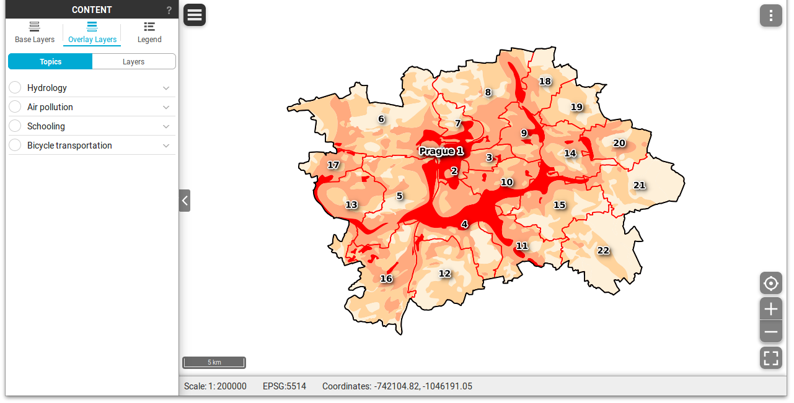

   Gisquick user interface description.

.. _content-menu:

Content management tools
========================

Content management widget is split into three major tabs:

* **Base Layers**
* **Overlay Layers**
* **Legend**

.. figure:: ../img/content-tabs.png
   :width: 250px
           
   Content tabs.

``Base Layers`` tab allows switching base layers in map canvas. The
list of base layers is defined by publication process as described in
:ref:`Project publishing <publication-base-layers>` section. Tab also
allows to set opacity of the base layer.

.. figure:: ../img/ui-base-layers.png
   :width: 250px
           
   Switching between base layers.
     
.. figure:: ../img/ui-opacity.png
   :width: 250px
           
   Setting opacity of the base layer.
     
``Overlay Layers`` tab allows switching between topics (layer groups),
see :ref:`Project publishing <publication-topics>` section, or
controlling overlay layers one by one.  Tab also allows to set opacity
of the overlay layers.

           
   Topics and layers switcher.

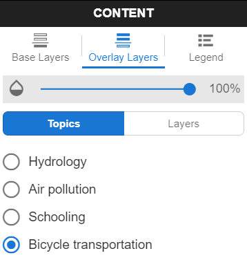
           
   Switching between topics.

.. figure:: ../img/ui-opacity.png
   :width: 250px
           
   Setting opacity of the overlay layers.

In ``Layers`` mode the overlay layers can be switch on/off one by one.

.. figure:: ../img/ui-map-layers.png
   :width: 250px
           
   Switch on/off overlay layers.

.. tip:: |tip| It is also possible to switch on/off group of layers
   |group-switcher|.

``Legend`` tab depicts currently selected layers in ``Layers`` tab.

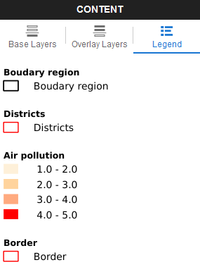
           
   Legend.

Attribute data
--------------

In ``Layers`` mode attribute data can be accessed by
|layer-attributes|. Attribute table is displayed in bottom part, see
figure below.

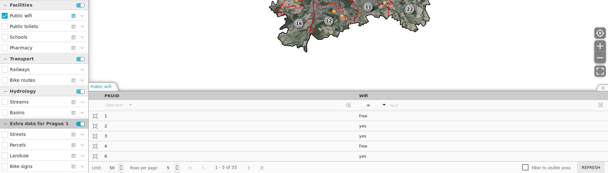
          
   Layer attribute table.

Attribute table allows filtering data based on simple queries, see
figures below.

.. figure:: ../img/ui-attribute-filter-0.png
   :width: 100px
           
   Choose operator for attribute filter.

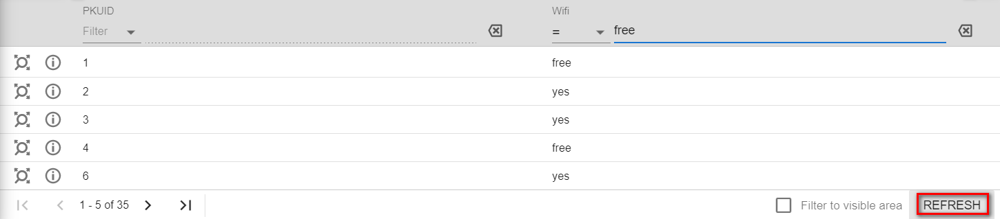

   Define filter and ``refresh`` attribute table view.

.. tip:: |tip| Attribute table shows only few rows. Use the arrows |scroll|
   to scroll through the rows. Attributes can be also 
   filtered by map canvas ``Filter to visible area``.

Every row in attribute table has *Zoom to* button |zoom-to| which
enables zooming and centering related features in map canvas, see
figure below.

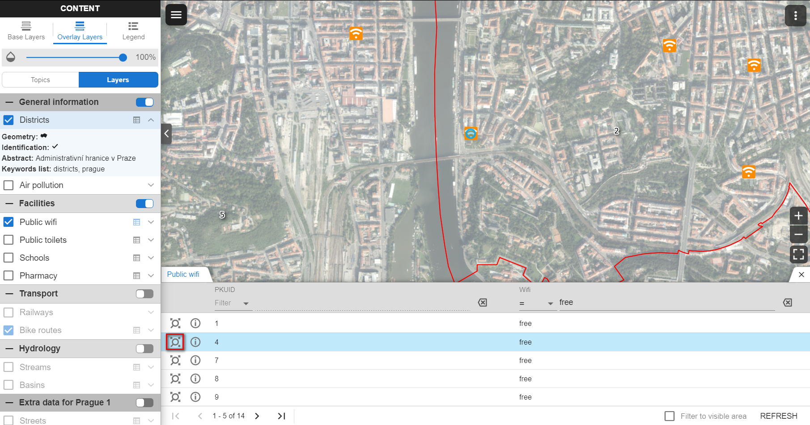

   Zoom into selected feature.

.. note:: Attribute filter can be disabled by |clear-filter|. Table
          view must be refreshed.

Also, every row has an *Information* button |info| which displays the
information panel with relevant data.

.. figure:: ../img/ui-info-feature.png

   Vizualization selected data.

.. _zoom-menu:

Zoom tools
==========

Zoom tools enable controlling map view. Two basic zoom tools are available:

* Zoom in/out |zoom-in-out|
* Zoom to extent |zoom-extent|

.. tip:: Zooming and panning is also possible by middle mouse button.
   
.. _tool-menu:

Tools
=====

Two basic tools are available:

* Identify |identify| and
* Measurement |measure|

Identify
--------

By default, features are identified in all visible layers (in the
example below in Schools and District layers).

.. figure:: ../img/identify.png

   Identify schools and district layer.

This settings can be changed in ``Identification`` combo box.

.. figure:: ../img/identification-layers.png
   :width: 250px
      
   Change layer priority for identification.

Measurement
-----------

Three measurement modes are available:

* Location (point coordinates)
* Distance
* Area

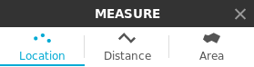
   
   Measurement tools.

.. figure:: ../img/measure-location.png

   Location measurement example. Menu highlighted in red ring.

Location menu allows:

* Zoom to location.
* Change spatial reference system. By default two system are
  supported: QGIS project system and WGS-84 (EPSG:4326) known as "GPS
  coordinates".

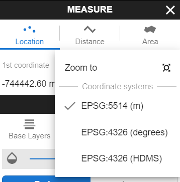
           
   Location menu.

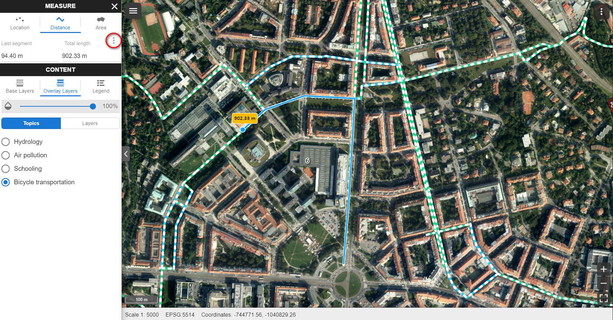

   Distance measurement example. Menu highlighted in red ring.

Distance menu allows:

* Zoom to distance.
* Change units. Currently, two systems are supported: international
  (EU) and imperial (UK, US)

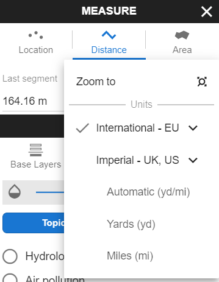
           
   Distance menu.

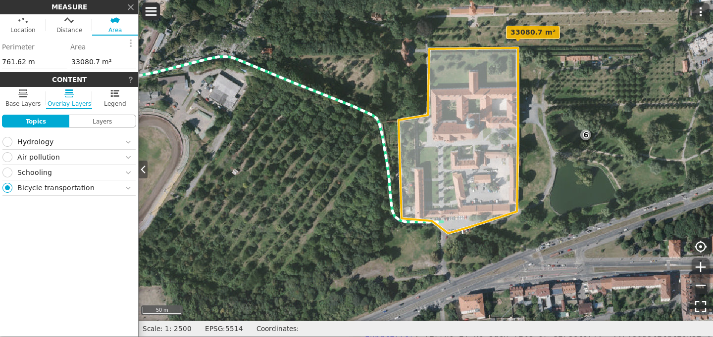

   Area measurement example. Menu highlighted in red ring.

Area menu allows:

* Zoom to distance.
* Change units. Currently two systems are supported: international
  (EU) and imperial (UK, US)

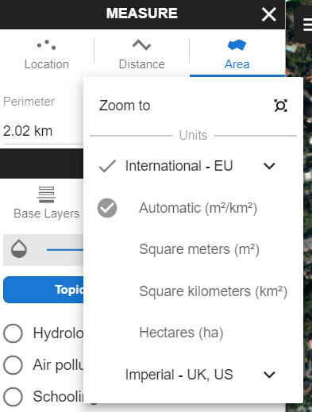
           
   Area menu.

.. note:: Currently, **no snapping** to features is supported by
          measurement tools.

.. _print-tool:

Print tool
----------

|print| Before :doc:`project publication <project-publishing>`, the
print tool can be actvivated in Gisquick, which enables one to
download raw output from QGIS server GetPrint request and allows
interactive visualization of map content directly in this template.
One can zoom, pan and rotate map and see exactly how the result will
look like. To get a better idea, see video below.

.. raw:: html

   
<iframe width="560" height="315" src="https://www.youtube.com/embed/1g0YduhPwpk" frameborder="0" allowfullscreen></iframe>

   

.. important:: |imp| Print tool in Gisquick is not accessible in
   :ref:`Guest session <guest-session>`, only log in users can use
   this tool.

.. _user-menu:
   
User menu
=========
         
User menu allows to:

* Log out current user
* Open user profile page
* Enter/Leave Full Screen mode
* Display attributions
* Show Help (this document)

.. figure:: ../img/map-attribution.png

   Map attributions displayed.

.. _user-profile-page:

User profile page
-----------------

User page (:menuselection:`My profile` in User menu) allows managing
published projects and uploading new ones. In ``Projects`` tab user 
can browse published projects including basic metadata. Project can 
be opened by clicking on its name.

.. figure:: ../img/ui-user-menu.png
   
   User page contains list of published projects.
   (Projects button is highlighted in red square)
   
.. tip:: Project data are available also via WMS service, click WMS link button |wms|. To open project in map canvas click |map|.

New projects can be uploaded by click an upload button. Note that
existing project will be automatically overridden. Projects can be
uploaded in ``zip`` or ``tag.gz`` formats.

.. note:: |note| See project size limits in :ref:`Configuration
   <docker-configuration>` section.

Another option is 'Experimental publishing'. There is publishing 
button for this option.
   
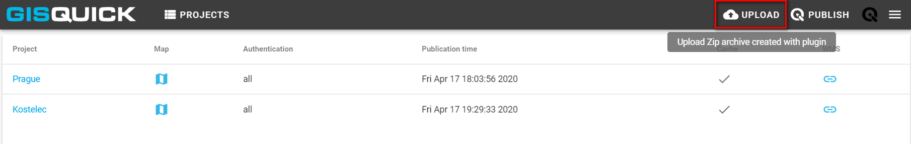

   Upload project button is highlighted in red square.
   Project publishing button is highlighted in green square.

Project setting is opened by clicking the project name. There are few
options in the settings window. It is possible to load map canvas using
map button (1). Use delete button (2) in case of removing whole project.
you delete your map. For logging out find the top right button (3).
Furthermore, it is possible to change the project title (4), set the
rate of autenthication (5) or edit map extent setting (6). There are few
possibilities how to edit map extent (7). First of all is to fill in the
desired coordinates into the frames. Secondly, map extent can be edited
manually by drawing a delimiting rectangle area in map. Last option is to
use extent of one imported layer or extent of all of them.
Setting map scales is possible in the left box (8). Executed changes are
reflected in map preview (9).

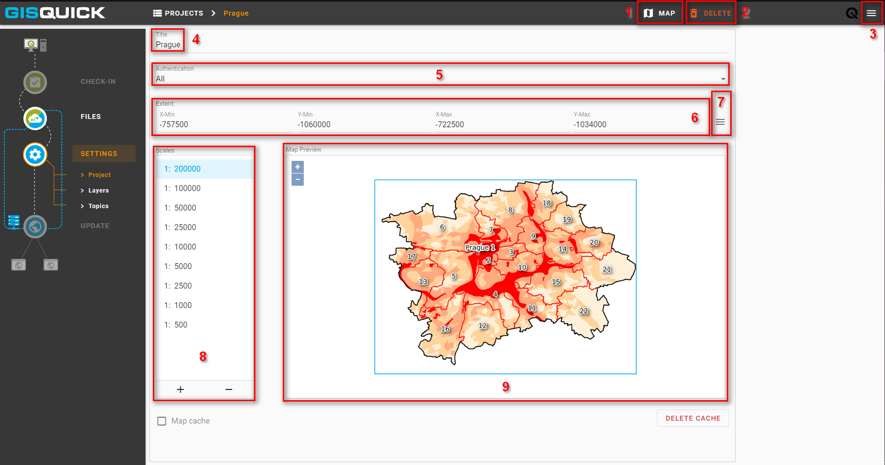

   Project setting.
 
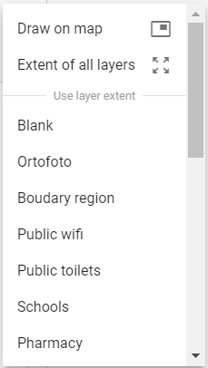

   Couple of ways how to set map extent.

Check the subsection Layers for advanced adjustment of layers. The base layer
can be chosen in the left box (a blank base map is default). Within the right
box it is possible to specify which layers will be published or hidden (or both
which means that the layer will be published but turned off when the project is opened). 

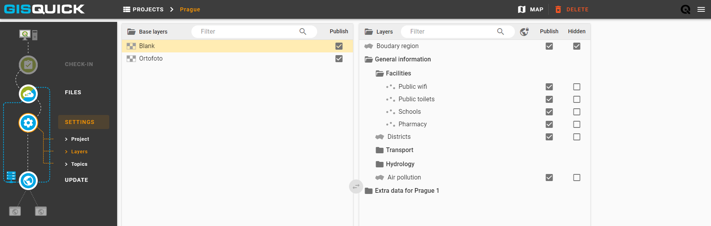

   Layers setting.

Last subsection is dedicated to topics. Creating or removing topic is enabled.
Select a topic to see involved features which can be subsequently modified.

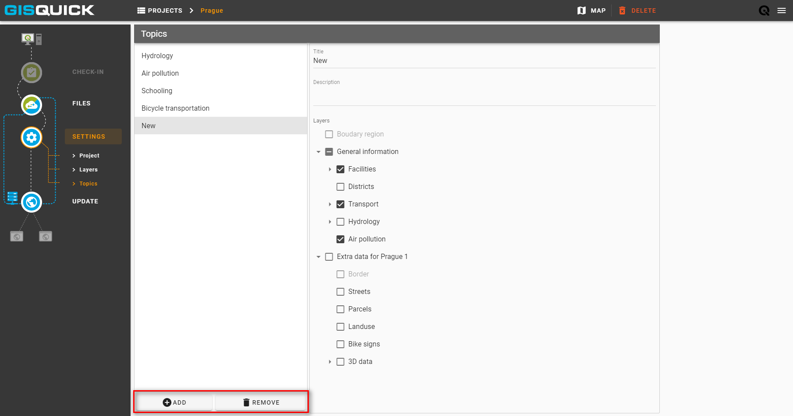

   Subsection Topics. Add and remove button are highlighted in red square.

In the very last step, hit the update button to save all realized changes and finish the experimental publishing process.

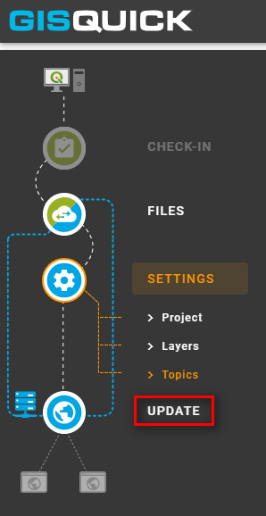

   Update button is highlighted in red square.